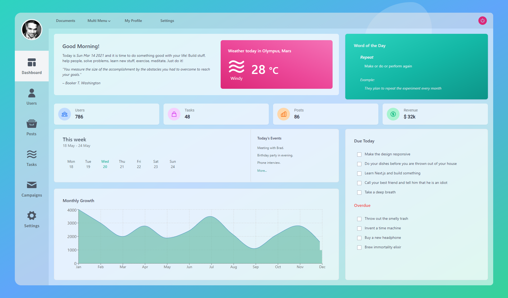

# Mint React 0.1.0 [](https://twitter.com/intent/tweet?url=https%3A%2F%2Fgithub.com%2Fantick%2Fmint-react&text=React-boilerplate&hashtags=react%2Ctailwindcss%2Creactjs)

  []() []()  [](https://discord.gg/6jgSTR2pAF)

A beautifully crafted boilerplate for starting a React JS and Tailwind css project using Mint Express as backend API.

**Demo:** Coming Soon

<p align="center">
    
</p>

Mint-React is a MERN Boilerplate/Starter Kit for those who want to build their apps in MERN stack. Mint Stack
is divided in different repositories for backend and frontend respectively. This one is for the React frontend.
Mint-React gives you some common functionalities out-of-the-box and insists on following the proper coding standards
with ESLint. Mint-React has enough features to get you started on any project that you plan to build on MERN stack.

## Features

1. Login and Registration
2. Forgot Password
3. Public and private routes
4. Robust token authentication
5. Modular architecture
6. Preconfigured Tailwind CSS
7. Pre-configured ESLint
8. Redux with hooks
9. Jest for unit tests with coverage report

## Quick start

Run `pnpm i` to install all the dependencies.

Run `pnpm watch:css` and `pnpm start` to watch the files and start the server.

## Quick start

#### `pnpm build:css`

Creates a build with updated style.css from index.css.

#### `pnpm watch:css`

Watch the changes done in the src/index.css and build them in public/style.css

#### `pnpm start`

Runs the app in the development mode.

Open [http://localhost:3000](http://localhost:3000) to view it in the browser.

#### `pnpm run build`

Builds the app for production to the `build` folder.

#### Docker

```bash
# run docker container
pnpm run docker

# run all tests in a docker container
pnpm run docker:test
```

## Directory Structure

```
|-- public
|-- src
  |-- assets
    |-- styles
  |-- config
  |-- modules
    |-- app
      |-- __tests__
      |-- components
    |-- auth
      |-- __tests__
      |-- components
      |-- hooks
      |-- reducers
      |-- utilities
    |-- shared
      |-- __tests__
      |-- actions
      |-- components
      |-- hooks
      |-- reducers
      |-- utilities
    |-- user
      |-- __tests__
      |-- actions
      |-- components
      |-- reducers
```

## Documentation

The documentation for Mint React is available [here](https://antick.github.io/mint).

## Reporting Issues

We use GitHub Issues as the official bug tracker for the Mint React. Here are some advises for our users
that want to report an issue:

1. Make sure that you are using the latest version of the Mint React.
2. Provide us reproducible steps for the issue that you encounter, so it's easier for us to fix that bug.

## Support

<a href="https://www.buymeacoffee.com/pankajsanam" target="_blank"></a>

## License

MIT License
